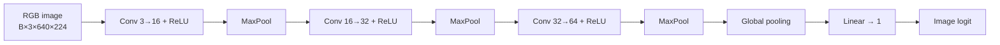
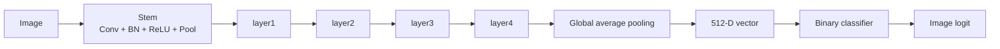
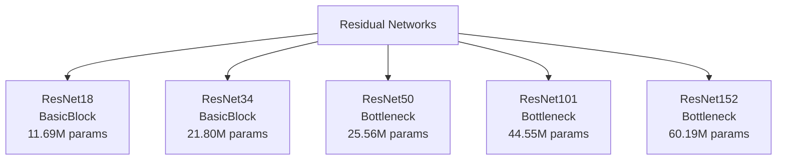
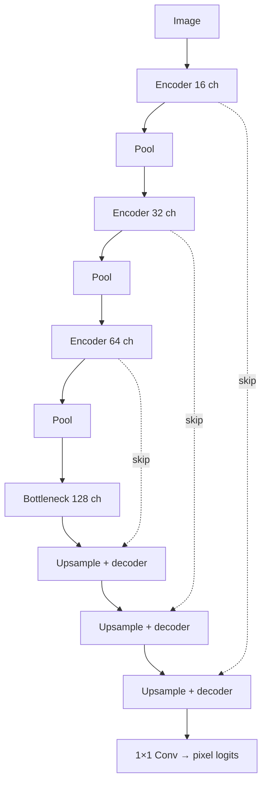
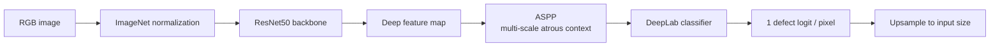
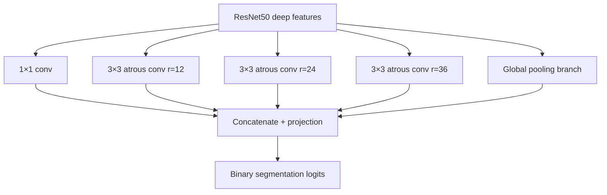
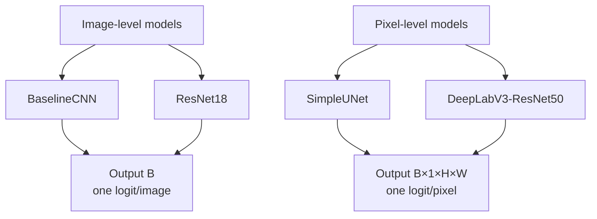
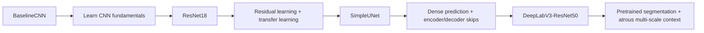

# Architecture atlas

This is the visual map of the neural-network architectures studied and used in the project.

The detailed notes explain each concept; this page answers at a glance:

- what the architecture is;
- what task it performs;
- what its main modules are;
- what tensor it produces;
- how it relates to the previous model.

## Architecture versus layer versus backbone

A **layer** is one operation such as `Conv2d`, `BatchNorm2d`, `ReLU`, `MaxPool2d` or `Linear`.

An **architecture** is the organization of many layers and connections into a complete model.

A **backbone** is the feature-extraction subnetwork inside a larger model.

Detailed notes:

- [Backbones](topics/backbones.md)
- [ResNet family](topics/resnet-family.md)

---

# 1. BaselineCNN — scratch image classifier

## Goal

Binary image-level classification:

> Does this image contain a defect?

Output:

```text
[B]
```

one logit per image.

## Diagram


```mermaid
flowchart LR
    A[RGB image<br/>B×3×640×224] --> B[Conv 3→16 + ReLU]
    B --> C[MaxPool]
    C --> D[Conv 16→32 + ReLU]
    D --> E[MaxPool]
    E --> F[Conv 32→64 + ReLU]
    F --> G[MaxPool]
    G --> H[Global pooling]
    H --> I[Linear → 1]
    I --> J[Image logit]
```

## Main lesson

A deliberately small CNN trained from random initialization. It made convolution, pooling, global pooling, logits, BCE and the training loop understandable before transfer learning.

Implementation:

`src/industrial_vision/models/baseline_cnn.py`

---

# 2. ResNet18 — pretrained residual classifier

## Goal

Image-level classification using a pretrained visual backbone.


```mermaid
flowchart LR
    A[Image] --> B[Stem<br/>Conv + BN + ReLU + Pool]
    B --> C[layer1]
    C --> D[layer2]
    D --> E[layer3]
    E --> F[layer4]
    F --> G[Global average pooling]
    G --> H[512-D vector]
    H --> I[Binary classifier]
    I --> J[Image logit]
```

## Residual block

```mermaid
flowchart LR
    X[Input x] --> F[Learned transformation F(x)]
    X --> S[Shortcut]
    F --> A[Add]
    S --> A
    A --> O[H(x)=F(x)+x]
```

ResNet18 uses `BasicBlock` residual units and has about **11.69M parameters** in its standard ImageNet classifier form.

Project use:

- EXP-008: pretrained backbone frozen;
- EXP-009: `layer4` partially fine-tuned.

Implementation:

`src/industrial_vision/models/resnet18_classifier.py`

For the complete canonical family (`18/34/50/101/152`), block types, stage repeats, parameters and feature-map dimensions, see [ResNet family](topics/resnet-family.md).

---

# 3. Canonical ResNet family


```mermaid
flowchart TD
    R[Residual Networks] --> R18[ResNet18<br/>BasicBlock<br/>11.69M params]
    R --> R34[ResNet34<br/>BasicBlock<br/>21.80M params]
    R --> R50[ResNet50<br/>Bottleneck<br/>25.56M params]
    R --> R101[ResNet101<br/>Bottleneck<br/>44.55M params]
    R --> R152[ResNet152<br/>Bottleneck<br/>60.19M params]
```

| Model | Block | Stage repeats | Standard classifier params |
|---|---|---|---:|
| ResNet18 | BasicBlock | `[2,2,2,2]` | 11,689,512 |
| ResNet34 | BasicBlock | `[3,4,6,3]` | 21,797,672 |
| ResNet50 | Bottleneck | `[3,4,6,3]` | 25,557,032 |
| ResNet101 | Bottleneck | `[3,4,23,3]` | 44,549,160 |
| ResNet152 | Bottleneck | `[3,8,36,3]` | 60,192,808 |

The project directly uses ResNet18 for classification and ResNet50 as the backbone inside DeepLabV3.

---

# 4. SimpleUNet — scratch semantic segmentation

## Goal

Pixel-level defect localization.

Output:

```text
[B,1,H,W]
```

one defect logit per pixel.

## Diagram


```mermaid
flowchart TD
    I[Image] --> E1[Encoder 16 ch]
    E1 --> P1[Pool]
    P1 --> E2[Encoder 32 ch]
    E2 --> P2[Pool]
    P2 --> E3[Encoder 64 ch]
    E3 --> P3[Pool]
    P3 --> B[Bottleneck 128 ch]

    B --> D3[Upsample + decoder]
    D3 --> D2[Upsample + decoder]
    D2 --> D1[Upsample + decoder]
    D1 --> O[1×1 Conv → pixel logits]

    E3 -. skip .-> D3
    E2 -. skip .-> D2
    E1 -. skip .-> D1
```

## Structural idea

The encoder builds context by reducing spatial resolution. The decoder reconstructs a dense output. U-Net skip connections copy high-resolution encoder features into the decoder to recover localization detail.

Implementation:

`src/industrial_vision/models/simple_unet.py`

This is the M4 segmentation baseline used in EXP-010 through EXP-013.

---

# 5. DeepLabV3-ResNet50 — pretrained semantic segmentation

## Goal

The same binary pixel-level task as SimpleUNet, but using a modern pretrained model family.


```mermaid
flowchart LR
    A[RGB image] --> B[ImageNet normalization]
    B --> C[ResNet50 backbone]
    C --> D[Deep feature map]
    D --> E[ASPP<br/>multi-scale atrous context]
    E --> F[DeepLab classifier]
    F --> G[1 defect logit / pixel]
    G --> H[Upsample to input size]
```

## Internal mental model


```mermaid
flowchart TD
    F[ResNet50 deep features] --> A1[1×1 conv]
    F --> A2[3×3 atrous conv r=12]
    F --> A3[3×3 atrous conv r=24]
    F --> A4[3×3 atrous conv r=36]
    F --> A5[Global pooling branch]
    A1 --> C[Concatenate + projection]
    A2 --> C
    A3 --> C
    A4 --> C
    A5 --> C
    C --> O[Binary segmentation logits]
```

## What is new compared with SimpleUNet?

| SimpleUNet | DeepLabV3-ResNet50 |
|---|---|
| scratch training | pretrained initialization |
| small custom encoder | ResNet50 backbone |
| symmetric encoder-decoder | no symmetric U-Net decoder |
| encoder-decoder skip connections | ASPP multiscale context |
| ordinary convolutions | atrous/dilated convolutions in ASPP |
| no BatchNorm | BatchNorm throughout ResNet/ASPP |
| input `[0,1]` | ImageNet normalization |
| relatively light | much larger compute/VRAM cost |

Implementation:

`src/industrial_vision/models/deeplabv3.py`

Training:

`scripts/train_deeplabv3.py`

Detailed notes:

- [`../segmentation/topics/deeplabv3-resnet50.md`](../segmentation/topics/deeplabv3-resnet50.md)
- [`../segmentation/topics/atrous-convolution.md`](../segmentation/topics/atrous-convolution.md)
- [`../segmentation/topics/aspp.md`](../segmentation/topics/aspp.md)

---

# Output contract across the project


```mermaid
flowchart TD
    A[Image-level models] --> A1[BaselineCNN]
    A --> A2[ResNet18]
    A1 --> AO[Output B<br/>one logit/image]
    A2 --> AO

    B[Pixel-level models] --> B1[SimpleUNet]
    B --> B2[DeepLabV3-ResNet50]
    B1 --> BO[Output B×1×H×W<br/>one logit/pixel]
    B2 --> BO
```

The important software-design choice is that both segmentation architectures expose the same output contract. Therefore the project can reuse:

- `BCEDiceLoss`;
- `train_one_epoch`;
- `evaluate`;
- segmentation metrics;
- threshold sweep;
- qualitative prediction tooling.

The model changes while the evaluation contract stays stable.

---

# Progression of architectural ideas


```mermaid
flowchart LR
    A[BaselineCNN] --> B[Learn CNN fundamentals]
    B --> C[ResNet18]
    C --> D[Residual learning + transfer learning]
    D --> E[SimpleUNet]
    E --> F[Dense prediction + encoder/decoder skips]
    F --> G[DeepLabV3-ResNet50]
    G --> H[Pretrained segmentation + atrous multi-scale context]
```

This order is intentional: each step introduces a limited number of new ideas while reusing the training/evaluation knowledge learned earlier.
